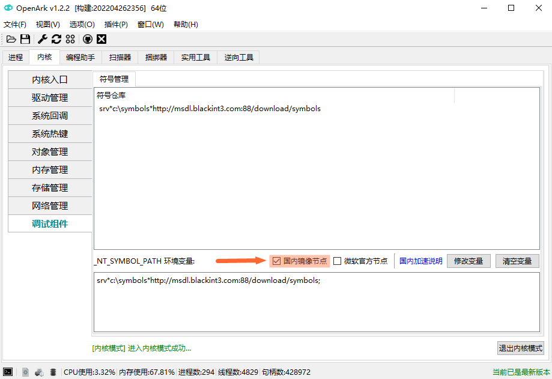

# SYMCN-SITE
Windows符号服务器镜像节点，用于国内加速。

# 为什么要开发这套系统？
* 首先响应速度和下载速度比官方节点快10倍以上
* PDB服务器的Azure云只有国外节点，因此IP可能被墙导致下载失败
* 国外网速慢等原因，导致丢包，PDB不完整加载失败
* Windbg、Visual Studio调试时的Busy状态绝大部分都是由于下载符号慢导致
* Procmon、Procexp、IDA等需要解析符号的软件，能在栈回溯、反汇编时快速获取对应符号
* 可提供文件查询、下载等诸多功能，将用于OpenArk或其他第三方软件

# 使用说明
* 方式1（强烈建议）：打开OpenArk（v1.2.2以上）---内核---调试组件---勾选国内镜像节点，建议只设置这个节点即可

* 方式2：手动更改环境_NT_SYMBOL_PATH环境变量，使用节点：http://msdl.blackint3.com:88/download/symbols

# 常见问题
* windbg加载符号提示mismatched：可能是符号下载不完整，删掉缓存目录对应的pdb文件，重新加载，.reload /f xxx.dll
* 环境变量不生效：重启explorer.exe
* 其他问题联系作者或issue.